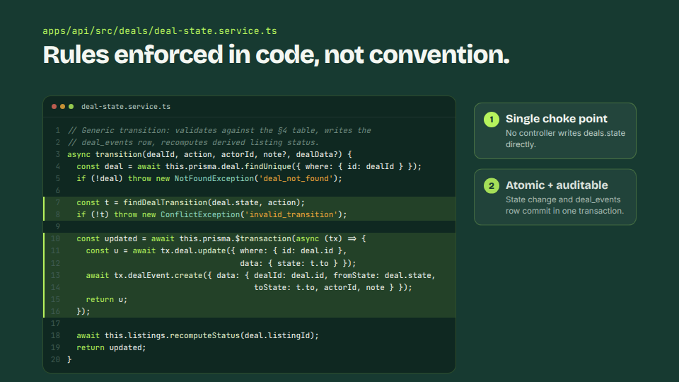
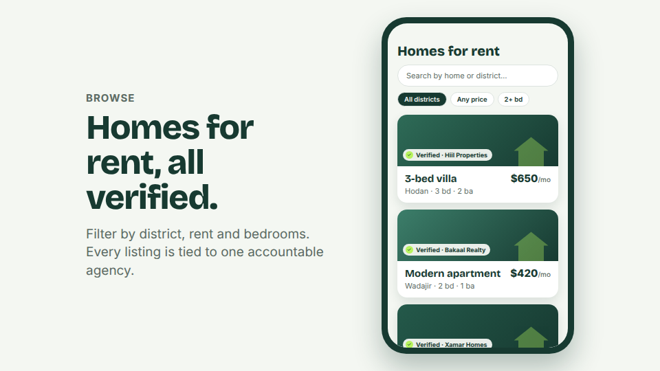
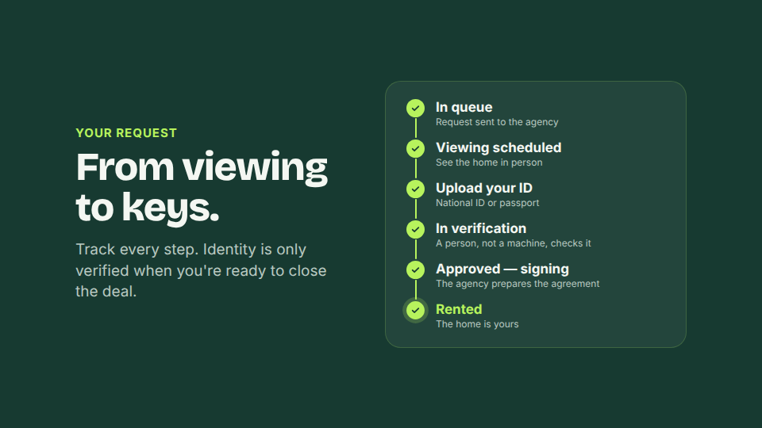
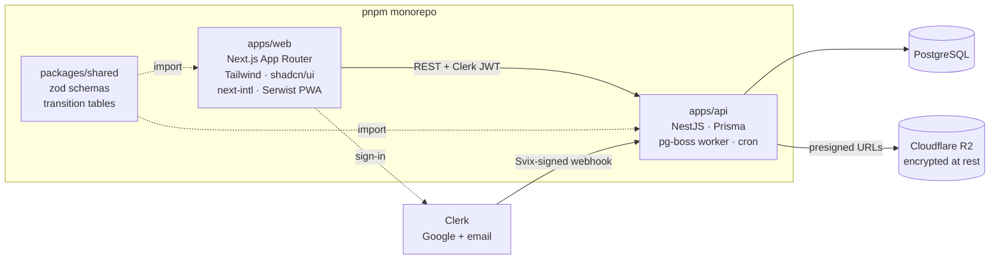
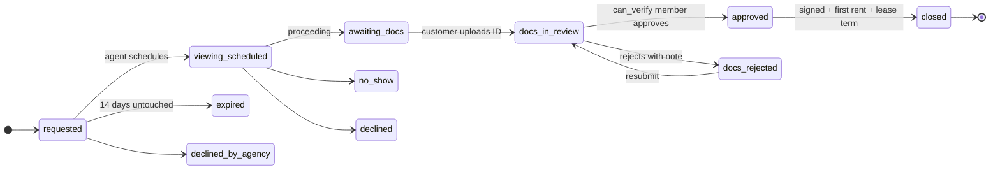
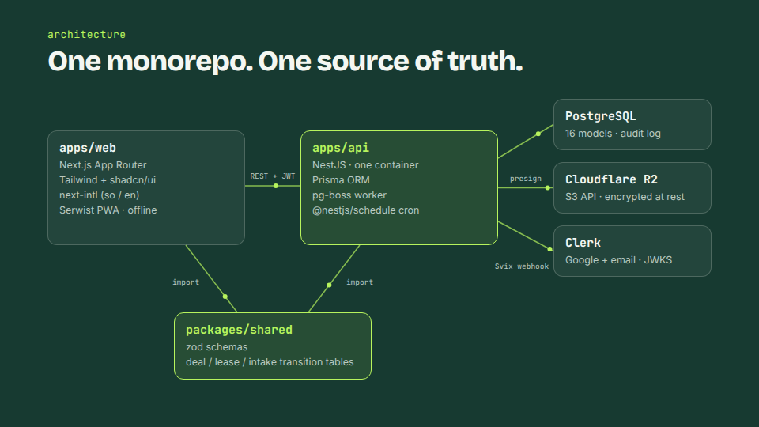
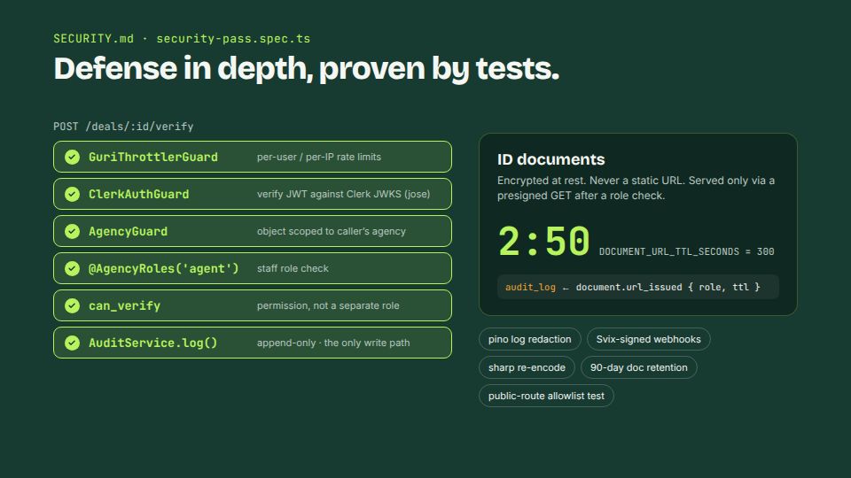
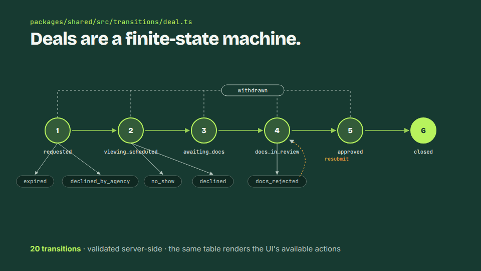
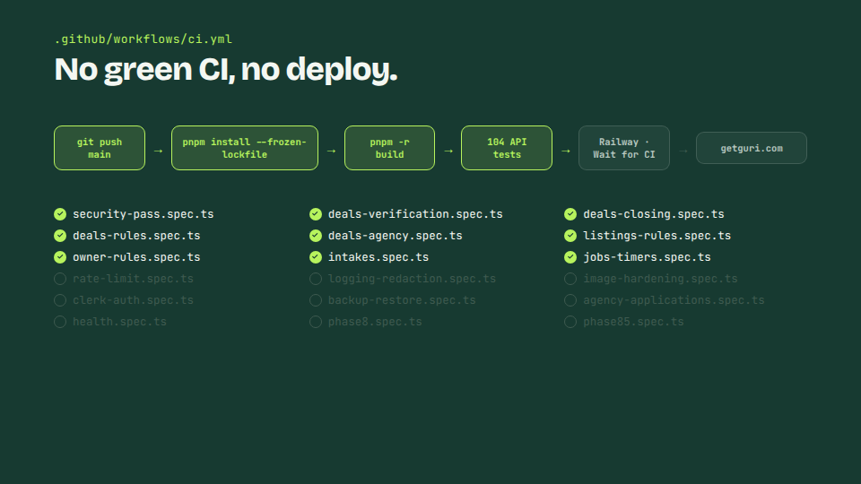

<div align="center">


# Guri

**A rental marketplace for Mogadishu, where every home is represented by a verified agency.<br />Designed, built and run in production end to end.**

[](https://github.com/bashiir-code/guri/actions/workflows/ci.yml)


[Technical reel](#-video-walkthrough) · [Architecture](#-architecture) · [Engineering highlights](#-engineering-highlights)

</div>

---

## 🎬 Video walkthrough

<table>
  <tr>
    <td width="50%" align="center">
      <a href="docs/media/guri-tech-reel.mp4"></a>
      <br /><b><a href="docs/media/guri-tech-reel.mp4">▶ Technical reel (56s)</a></b>
      <br /><sub>Architecture, state machine, real code, security, CI/CD</sub>
    </td>
    <td width="50%" align="center">
      <a href="docs/media/guri-promo.mp4"></a>
      <br /><b><a href="docs/media/guri-promo.mp4">▶ Product promo (31s)</a></b>
      <br /><sub>What customers, agencies and owners see</sub>
    </td>
  </tr>
</table>

Both videos are written in code with [Remotion](https://www.remotion.dev/) (React → MP4). The source is in [`video/`](video/).

## What it is

Guri is a mobile-first PWA that brings trust to a rental market where listings usually spread through word of mouth.

- **Every listing is tied to one accountable, verified agency.** Nothing an owner submits is public until an agency converts it into a listing.
- **Customers browse with a lightweight profile.** Their identity is checked by a person, only when they're ready to close.
- **Every document view and verification decision is written to an immutable audit log.**
- **Five roles share one sign-in:** customer, owner, agency agent, agency admin (with a `can_verify` permission) and platform admin. Roles are resolved server-side; the client never claims one.
- **Bilingual (Somali + English)**, installable, and built for low-bandwidth networks.

<p align="center">
  
  
</p>

## 📊 By the numbers

| | |
|---|---|
| **~21,000** lines of TypeScript | **104** API tests in **18** suites, gating every deploy |
| **16** Prisma models, **11** migrations | **12** deal states, **20** validated transitions |
| **5** roles, one sign-in | **2** languages (so / en) |

## 🏗 Architecture



- **One source of truth for business rules.** The deal, lease and intake transition tables live in `packages/shared`. The API validates against them, and the web app uses the same tables to decide which actions to render.
- **One long-running API container** runs HTTP, the pg-boss job worker and the cron scheduler together. It's simple to operate, and there's no need for microservices at this scale.
- **Auth is delegated, authorization is owned.** Clerk handles sessions and credentials. Every object-level access decision is enforced by NestJS guards in this codebase.

## ⚙️ Engineering highlights

### A deal is a finite-state machine



Every transition goes through **one service**. It validates against the shared table, writes the state change and a `deal_events` row in **one database transaction**, then recomputes the listing's status. No controller ever writes `deals.state` directly.

```ts
// apps/api/src/deals/deal-state.service.ts
const t = findDealTransition(deal.state, action);
if (!t) throw new ConflictException('invalid_transition');

const updated = await this.prisma.$transaction(async (tx) => {
  const u = await tx.deal.update({ where: { id: deal.id }, data: { state: t.to } });
  await tx.dealEvent.create({ data: { dealId: deal.id, fromState: deal.state, toState: t.to, actorId, note } });
  return u;
});

await this.listings.recomputeStatus(deal.listingId);
```

**Listing status is derived, never written.** A live lease makes a listing `rented`, a reserving deal makes it `reserved`, and otherwise it's `available`. The status can't drift from reality.

### Security that's enforced by tests

Documented in [SECURITY.md](SECURITY.md) and asserted by [`security-pass.spec.ts`](apps/api/test/security-pass.spec.ts). A regression breaks the build instead of shipping.

- **Layered guards on every route:** rate limiting → `ClerkAuthGuard` (JWT verified against JWKS) → `AgencyGuard` (object scoped to the caller's agency) → role decorators → `can_verify` permission.
- **A public-route allowlist test.** Any new controller that skips auth fails CI.
- **ID documents are never served by static URL.** They're only available through presigned GETs with a **5-minute TTL**, issued after a role check. Every issuance writes an `audit_log` row.
- **`audit_log` is append-only.** There's exactly one write path in the codebase, and no update or delete path exists.
- **Svix-verified webhooks**, per-user and per-IP rate limits, sharp re-encoding of uploads, pino log redaction of tokens and presigned URLs, and a 90-day retention purge of documents from dead deals.

### Background jobs that nudge but never evict

A pg-boss runner executes the timer table every 15 minutes: 14-day request expiry, a 72-hour viewing-outcome nudge, a 48-hour verifier reminder, and a 30-day lease-ending notice. Concurrent cron enqueues are deduplicated with a singleton window. By design, **a lease only leaves `rented` when a person records the outcome** (renew or move-out). A timer can never terminate a tenancy.

### CI-gated continuous deployment

`git push main` → GitHub Actions (`pnpm install --frozen-lockfile` → build all packages → 104 API tests) → Railway auto-deployed web + API with **Wait for CI**. No green CI, no deploy. Migrations ran as a pre-deploy step, and backup-and-restore is covered by its own test suite.

<p align="center">
  
  
  
  
</p>

## 🧰 Tech stack

| Layer | Choices |
|---|---|
| Frontend | Next.js (App Router), React, Tailwind CSS, shadcn/ui, next-intl, Serwist (PWA) |
| Backend | NestJS, Prisma, PostgreSQL, pg-boss, @nestjs/schedule, zod |
| Auth | Clerk (Google + email/password), JWKS verification with `jose`, Svix webhooks |
| Files | Cloudflare R2 (S3 API, MinIO locally), sharp, @react-pdf/renderer |
| Infra | GitHub Actions CI; ran in production on Railway (web + API + Postgres) behind Cloudflare |
| Testing | Vitest API suites: state machine, guards, security pass, timers, rate limits, backups |

## 📚 Documentation

| File | What it holds |
|---|---|
| [SPEC.md](SPEC.md) | **Source of truth**: roles, data model, deal state machine, API, phases |
| [CLAUDE.md](CLAUDE.md) | Working brief + the non-negotiable product rules |
| [LAUNCH.md](LAUNCH.md) | Production setup: env vars, domains, Clerk, go/no-go checklist |
| [OPERATIONS.md](OPERATIONS.md) | Day-2 ops: deploys, backups & restore, scaling ledger, perf posture |
| [SECURITY.md](SECURITY.md) | Security posture, enforced by `security-pass.spec.ts` |

## 🚀 Getting started

Prerequisites: Node 22+, pnpm 10, Docker (Postgres + MinIO).

```bash
cp .env.example .env         # fill in Clerk dev keys + local URLs
pnpm install
pnpm db:up                   # docker compose: Postgres + MinIO
pnpm db:migrate              # prisma migrate dev (also generates the client)
pnpm dev                     # builds shared, then runs web (:3000) + api (:4000)
```

Sign in with Google via Clerk's dev instance. The webhook/guard mirrors your user row into Postgres on first request. To exercise every role from one account, seed the dev test data:

```bash
pnpm --filter @guri/api db:seed-test    # grants the test account all roles + demo portfolio
```

### Scripts

| Command | What it does |
|---|---|
| `pnpm dev` | shared build, then web + api in parallel watch |
| `pnpm build` | full monorepo build (same as CI) |
| `pnpm db:up` / `pnpm db:down` | local Postgres + MinIO via Docker Compose |
| `pnpm db:migrate` | create/apply a Prisma migration locally |
| `pnpm --filter @guri/api test` | API test suite (state machine, guards, security pass) |
| `pnpm --filter @guri/api db:deploy` | apply migrations in prod (Railway pre-deploy) |

### CI and deployment

Every push to `main` and every pull request runs GitHub Actions: it builds all packages and runs the API suite. While Guri was live, Railway (with **Wait for CI**) auto-deployed web + api from green builds. The production hosting has since been retired, and the repo is now kept as a portfolio project. [LAUNCH.md](LAUNCH.md) and [OPERATIONS.md](OPERATIONS.md) document how production was set up and run.

---

<div align="center">

Built by [**@bashiir-code**](https://github.com/bashiir-code)

</div>
